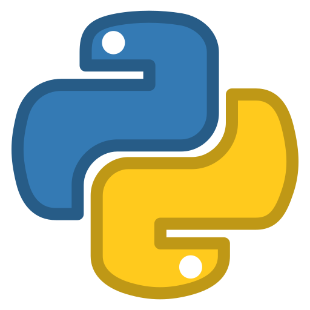

I'm Sajitha Madugalle, a Biomedical Engineering undergraduate passionate about Electronics, Biomedical device designing, and Machine Learning. 🚀

### Interested In

 Python &nbsp; &nbsp;
 C++ &nbsp; &nbsp;
 Machine Learning &nbsp; &nbsp;
 Electronics 

### Connect with Me

[ Linkedin](https://www.linkedin.com/in/sajitha-madugalle-2a2172241) &nbsp; &nbsp;
[ Instagram](https://instagram.com/__sajitha_madugalle_?igshid=OGQ5ZDc2ODk2ZA==)

Feel free to connect with me on LinkedIn or Instagram to discuss collaborations and projects!
