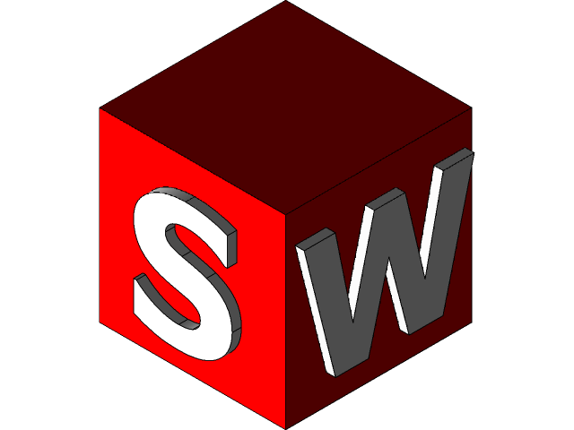

I'm Sajitha Madugalle, a Biomedical Engineering undergraduate passionate about Electronics, Biomedical device designing, IC Designing and Computer vission. 🚀

## Interested In

 Electronics &nbsp; &nbsp;
 PCB designing &nbsp; &nbsp;
 3D model designing &nbsp; &nbsp;
 Human Computer Interaction &nbsp; &nbsp;

## Tools
 Altium Designer &nbsp; &nbsp;
 Solid Works &nbsp; &nbsp;
 openCV &nbsp; &nbsp;
 python &nbsp; &nbsp;
 C++ &nbsp; &nbsp;

### Connect with Me

[ Linkedin](https://www.linkedin.com/in/sajitha-madugalle-2a2172241) &nbsp; &nbsp;
[ Instagram](https://instagram.com/__sajitha_madugalle_?igshid=OGQ5ZDc2ODk2ZA==)

Feel free to connect with me on LinkedIn or Instagram to discuss collaborations and projects!

